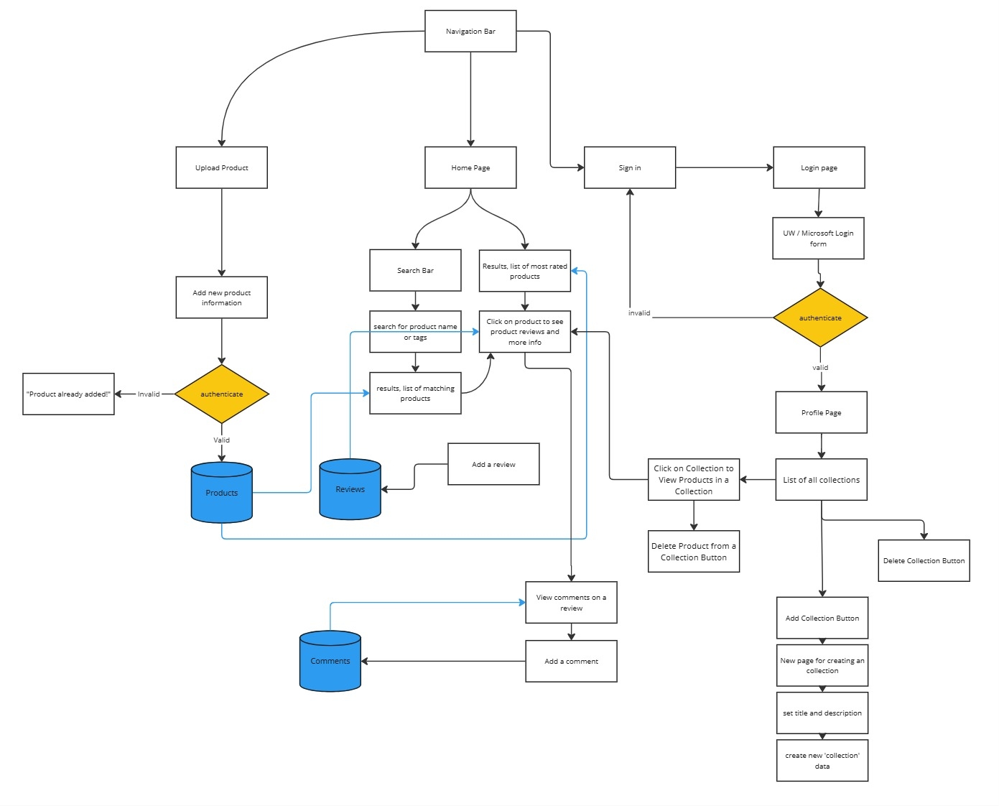
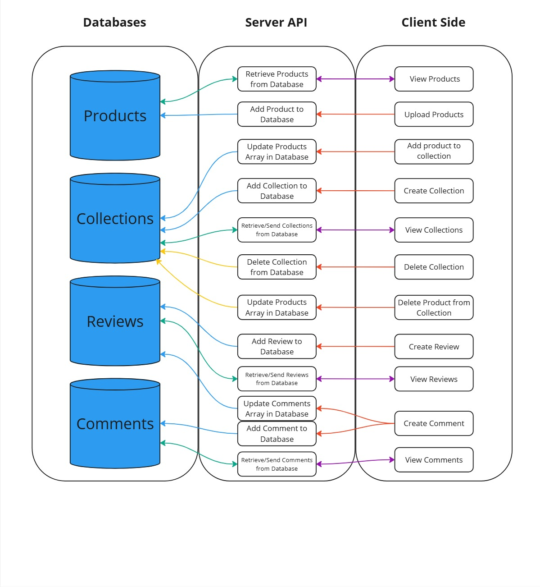

# Group 1's Project Proposal
By: Yenmy Vo, Celestine Le, Lindsy Marroquin, and Bella Gatzemeier

# Project Description 

## Who is our target audience?
Our application is designed for inexperienced consumers of skincare products who want to learn more about products before purchasing them. It specifically aims to support those who struggle to find products that meet their needs—whether they are seeking a cleanser for oily skin or a serum to target acne. With our application, users can become informed consumers and keep track of products they want to add to their routines.

Our application also encourages a user-driven database of products and reviews so that new and experienced users alike can upload products not yet in our database, as well as rate and add tags to products. Users are encouraged to review products and comment/upvote reviews, fostering community amongst skincare product consumers while relying on user experiences to verify products. 

## Why does our audience want to use our application?
Our audience is inexperienced with skincare products and needs a convenient resource for learning about skincare products before they incorporate them into their regular routines. Skincare products can often have ranging results depending on a person’s physiology, so consumers want to hear directly from people like them who have navigated the same products while having oily skin or specific allergies. Our centralized skincare product wikipedia helps consumers minimize how much time and money they spend on products before finding the ones that meet their needs. Moreover, our application will help foster a community that informs and empowers one another, connecting users to people who share the same struggle in finding products that suit their skin type. Rather than face these challenges alone, skincare product consumers will have a place to learn from and alongside others.

## Why We Want to Build This Application
As a team of developers with a variety of skincare needs, we understand that not everyone will have the same experience with a skincare product. Thus, we are motivated to highlight and normalize this range of experiences and support consumers in finding skincare products that make them feel confident and included.

We also believe that fostering community is important to ensure that users can become well-informed consumers and support them throughout their individual journeys, whether that be establishing a daily skincare routine or shifting to vegan/cruelty-free products. Since our website is user-driven, we want to cultivate collaborative engagement amongst our user base and encourage agency with the products they consume.

We all have struggled with products that fit our skin. Overall, our project aims to help those who struggle to find their skincare product fit through a community-based forum. In this crowd-sourced website, we hope to facilitate discussions and reviews for those undergoing similar skincare struggles.

# Technical Description

## Architectural Diagrams

## Data Flow

## Summary Tables for User Stories
|   Priority    |      User     |  Description  |  Technical Implementation  |
| ------------- | ------------- | ------------- | -------------------------- |
|      P0       |   As a user   | I want to be able to create an account/profile and log in/out of it | When logging in, use Azure Authentication to verify users.
|      P0       |   As a user   | I want to be able to upload a product that is not already on the website | When uploading a product, add the product to MongoDB with attributes such as name, skincare category, description, and hyperlink to an image of the product.
|      P0       |   As a user   | I want to be able to view skincare products | When loading the homepage, retrieve a JSON of product previews that include name, category, image, and description for each product.
|      P1       |   As a user   | I want to be able to search skincare products | When searching for products, retrieve all product names that contain the user input.
|      P1       |   As a user   | I want to be able to view reviews on products | When loading a specific product page, retrieve the product’s name, category, image, description, and reviews.
|      P1       |   As a user   | I want to be able to leave reviews on products | When leaving a review on a product, add the review to the reviews database on MongoDB with attributes such as username, product ID, review text, and an integer between 1-5 representing the product rating.
|      P1       |   As a user   | I want to be able to sort and filter products according to {cost and typical skincare categories} | Filter and order results according to the applied tags from the products database.
|      P2       |   As a user   | I want to be able to comment on reviews | When commenting on a review, retrieve the specific review from the database and add the comment to the associated review in MongoDB.
|      P2       |   As a user   | I want to create new product collections when signed in | When creating a new collection, add collection to MongoDB using the user's username.
|      P2       |   As a user   | I want to add an existing product to my collection | When adding products to a collection, add selected product with its unique ID to the corresponding collection, updating in MongoDB.
|      P2       |   As a user   | I want to be able to view my profile | Retrieve all collections in the database related to the specific username and display the collections.

## API Endpoints
GET /signin - Allows users to log into their UW account (Azure authentication).

GET /signout - Allows users to log out of their UW account (Azure authentication).

GET /api/v1/users/myIdentity - Allows developers to view if a user is currently logged in according to the session and shares the name and username of the signed-in account.

GET /api/v1/posts?productID - Allows users to view specific product information, including name, category, description, and image.

POST /api/v1/posts - Allows users to upload a product, including user-inputted product name, category, description, and image.

GET /api/v1/posts/search?query&price&category - Allows users to search existing products based on their input from the search bar or filtering methods (price and category).

GET /api/v1/reviews?productID - Allows users to view reviews on a specific product.

POST /api/v1/reviews?productID - Allows signed-in users to upload a review for a specific product.

GET /api/v1/reviews/comments?commentID - Allows users to view comments on a product review.

POST /api/v1/reviews/comments?commentID - Allows signed-in users to post a comment on a product review.

GET /api/v1/collections - Allows signed-in users to view previews of all their collections.

POST /api/v1/collections - Allows signed-in users to create a new collection, adding a collection name, description, and cover image.

DELETE /api/v1/collections?collectionID - Allows users to delete a specific collection from their profile and database.

GET /api/v1/collections/collection?collectionID - Allows users to retrieve a specific collection, containing information like collection name, products, and description.

POST /api/v1/collections/product?productID - Allows users to add a specific product to a collection.

DELETE /api/v1/collections/product?productID - Allows users to delete a specific product from the collection.

## Database Schemas
Products
- <ins>Product ID (String)</ins>
- Product Name (String)
- Product Category (String)
- Price (String)
- Image URL (String representing a hyperlink)

Collections
- <ins>Collection ID (String)</ins>
- Username (String)
- Collection Name (String)
- Products (Array of Products),
- Collection Description (String),
- Collection Cover Image URL (String representing a hyperlink)

Reviews
- <ins>Review ID (String)</ins>
- Review Text (String)
- Product ID (String)
- Username (String)
- Rating (Number)
- Comments (Array of Comments)
- Date (Date)

Comments
- <ins>Comment ID (String)</ins>
- Username (String)
- Comment (String)
- Date (Date)